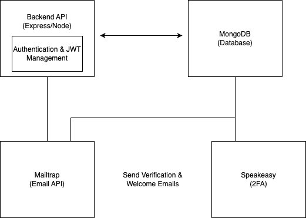

# Authentication System Containerisation Planning

This document explains the full application architecture of a secure user management system, including user authentication, 2FA, email verification, and session handling.

# Application Architecture Diagram

## High-Level AAD Explanation

## This Application Architecture Diagram (AAD) outlines a backend focused system built with Node.js and Express. It demonstrates how the backend API interacts with a MongoDB database and integrates with external services like [Mailtrap](https://mailtrap.io) for email delivery and [Speakeasy](https://github.com/speakeasyjs/speakeasy) for two-factor authentication. The architecture ensures secure user management, including email verification and 2FA, while supporting token based authentication using [JWT](https://jwt.io).

### Backend API (Node.js with Express)

#### Responsibilities:

- Core logic engine of the app.
- Routes for registration, login, logout, 2FA setup/verify, email verification, etc.
- Central control point for interacting with all other services and databases.
- Implements middleware layers for:
  - Validating JWTs
  - Handling authentication
  - Managing request/response cycles

#### Authentication & JWT Management

- **JWT Creation**: When the user successfully logs in and passes 2FA, the server generates a signed JWT.
- **Token Usage**: This JWT is required in headers for protected endpoints.
- **Token Verification**: Middleware checks the validity of incoming tokens.

#### Interactions:

- Communicates with **MongoDB** to fetch/write user data.
- Sends user email info to **Mailtrap**.
- Coordinates 2FA token generation/validation with **Speakeasy**.

---

### MongoDB (Database)

#### Responsibilities:

- Stores persistent user data: email, hashed password, 2FA secret, verification tokens, etc.

#### Interactions:

- Queried by the backend API during registration, login, and verification.

---

### Mailtrap (Email API for Development)

#### Responsibilities:

- Email sandbox for development/testing.
- Sends:
  - Verification emails
  - Welcome emails

#### Step By Step Flow:

1. _User Triggers Email Event:_
   A user will perform the action of signing up which is captured by the frontend and sent as a request to the Backend API.

2. _Backend Prepares Email:_
   The backend uses a helper function (e.g. `sendVerificationEmail`) to compose the email content. This includes:

   - Recipient email address
   - Subject line
   - Verification link/token
   - HTML/plaintext body

3. _Send Via Mailtrap:_
   The composed email data is sent to Mailtrap via a POST request. Mailtrap acts as a development SMTP server, intercepting emails so they do not reach real users.

4. _Mailtrap Response:_
   Mailtrap simulates the sending of the email and returns a response to the backend indicating success or failure.

5. _Welcome Email:_
   If the verification is successful, the system will trigger a welcome email through a similar path.

---

#### Benefits Of Using Mailtrap:

- Safe testing of transactional emails
- Avoids spamming real users
- Useful for debugging and reviewing email formatting
- Easy to integrate into CI/CD pipelines or dev workflows

---

### Speakeasy (2FA Library)

#### Responsibilities:

- Generates TOTP 2FA secrets.
- Verifies TOTP tokens during login.

#### Step By Step Flow:

1. _User Signs Up and Enables 2FA:_
   The user will be automatically guided to the 2FA after signing up. The backend uses Speakeasy to generate a time based one time password (TOTP) secret.

2. _Secret Sent To User:_
   The TOTP secret is converted into a QR code (e.g., using qrcode npm package) and sent to the user via frontend. The user scans it with an authenticator app like Google Authenticator or Authy.

3. _User Logs In With 2FA Code:_
   After submitting correct credentials, the frontend prompts the user for their 2FA code. This code is submitted back to the backend for validation.

4. _Backend Verifies Code:_
   Speakeasy checks the code against the saved secret using `totp.verify()`

5. _Success Or Failure:_
   - If valid, the backend allows the login to proceed and generates a JWT.
   - If invalid, an error response is returned and access is denied.

---

#### Why It's Important:

- Greatly reduces the risk of credential-based breaches.
- Even if passwords are compromised, the attacker can’t log in without the 2FA code.
- Easy to implement and widely supported.

---

### Authentication & JWT Management Flow Explanation

#### Responsibilities

To ensure users are securely authenticated and can maintain a session across multiple requests.

#### Step By Step Flow:

1. _User Logs In:_
   The user submits credentials (email/password) through the frontend

2. _Backend Validates Credentials:_
   The Express backend checks credentials against stored values in MongoDB (passwords hashed via `bcrypt`)

3. _2FA Check:_
   The system will envoke the 2FA Flow. If successful, it continues to the next step

4. _JWT Generation:_
   Once verified, the backend generates a JWT (JSON Web Token) using a secret key. The JWT contains:

   - User ID
   - Issued timestamp
   - Expiry (e.g., 1h or 7d)

5. _Token Sent To Client:_
   The JWT is sent back to the frontend and stored in localStorage or as an HTTP-only cookie

6. _Authentication Requests:_
   On every future API request, the JWT is sent in the Authorisation header. The backend validates the token using middleware (e.g., `express-jwt` or custom logic).

7. _Token Expiry:_
   If the token is expired or invalid, the user is asked to log in again.

---

#### Why JWT:

- Stateless authentication (no session stored on server)
- Easy to scale across services
- Secure when properly signed and stored

---
